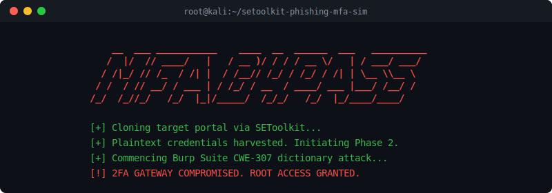

 

*A multi-stage Red Team lab demonstrating spear-phishing, credential harvesting, and MFA bypass via CWE-307.*

 

> **Project Overview:** This research project and lab exercise demonstrates the critical vulnerabilities in standard Time-Based One-Time Password (TOTP) implementations when subjected to targeted spear-phishing and automated brute-force attacks.

---

## ⚙️ Lab Environment & Topology

The simulation was engineered from scratch and executed within a strictly controlled VirtualBox NAT network to ensure zero external impact while mirroring a realistic enterprise topology:

- **Attacker Machine:** Kali Linux (Nmap, Social-Engineer Toolkit, Burp Suite)
- **Target Server:** Ubuntu Server (Apache, vulnerable custom PHP authentication gateway)
- **Victim Machine:** Windows 11 (Standard user environment)

---

## 🗡️ The Attack Chain

The exercise followed a realistic cyber kill chain, from initial reconnaissance to full objective execution:

### 1. Reconnaissance & Footprinting
Utilized `nmap` to map the target server's open ports and identify the running HTTP services to find the login gateway.

### 2. Credential Harvesting
Leveraged the Social-Engineer Toolkit (SET) to clone the target university learning portal. Deployed a simulated spear-phishing email to redirect the victim to the cloned site, successfully capturing plaintext credentials.

### 3. MFA Bypass (CWE-307)
After obtaining the primary credentials, the attacker faced a TOTP MFA prompt. Due to an intentional lack of rate-limiting (*Improper Restriction of Excessive Authentication Attempts*), the gateway was vulnerable.

### 4. Automated Dictionary Attack
Configured Burp Suite Intruder with a custom numeric payload to brute-force the 4-digit OTP space, successfully bypassing the secondary authentication layer and gaining full access.

---

## 🛡️ Mitigation & Blue Team Recommendations

Understanding the attack vector is only half the battle. The technical report outlines critical remediation strategies to secure authentication gateways against this exact methodology:

- **Rate Limiting & Lockouts:** Implementation of strict exponential backoff and account lockouts after consecutive failed OTP attempts to neutralize automated Intruder attacks.
- **FIDO2 / WebAuthn:** Upgrading from phishable TOTP codes to hardware-bound, origin-bound authentication protocols (like YubiKeys) to neutralize credential harvesting and adversary-in-the-middle (AitM) attacks.

---

## 📄 Technical Documentation

For a deep dive into the exact commands, payload configurations, footprinting results, and step-by-step methodology, please read the full academic report:

👉 **[View the Full Lab Report (PDF)]((https://github.com/user-attachments/files/27807177/CSCI369_PROJECT_8952978.pdf))**
